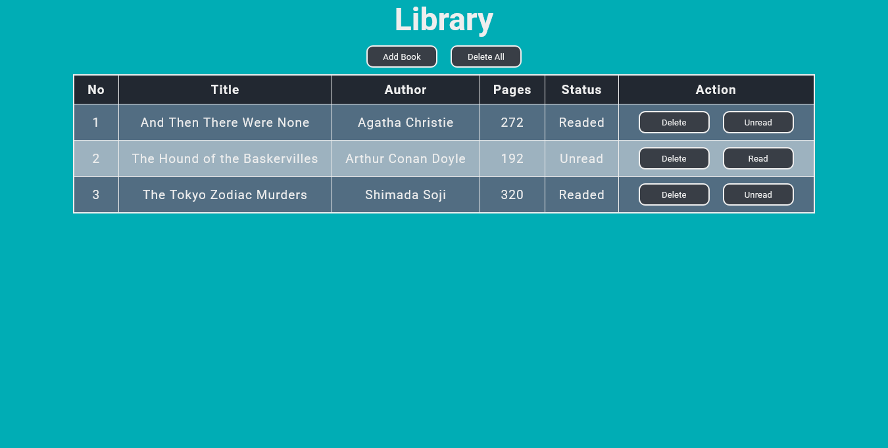
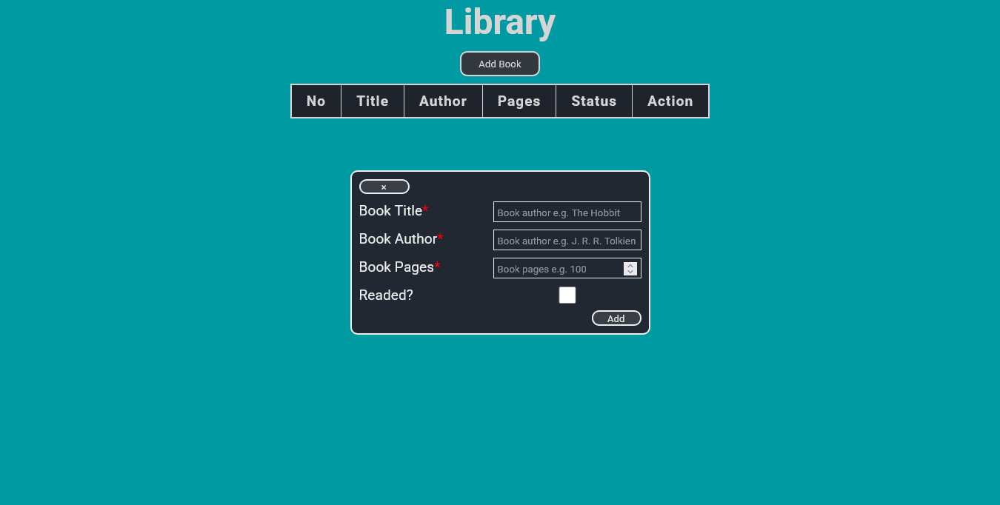

# library

Libary project exercises from odin project, implementing javascript objects and objects constructors, all data is stored in local storage, so it is not lost when refreshed, users can add book data (author, title, number of pages, reading status), after adding a book, users can delete it and change the reading status via the read butto, and there is a button to delete all book data.

